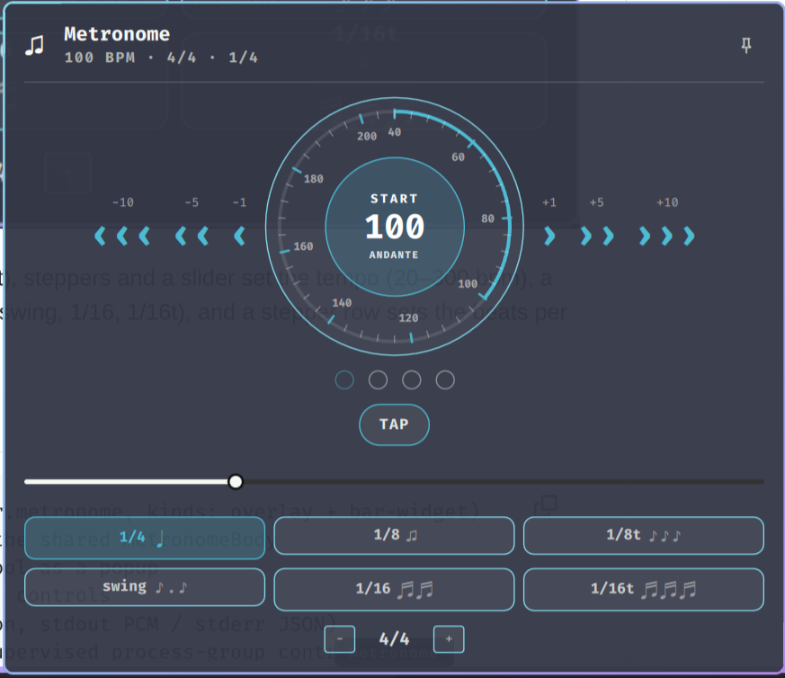

# omarchy-metronome

An [Omarchy](https://omarchy.org/) shell plugin: a metronome.



▶ starts it, dots show the beat (green accent on the downbeat), steppers and
a slider set the tempo (20–300 bpm), a TAP button taps it in, tiles pick the
subdivision (1/4, 1/8, 1/8t, swing, 1/16, 1/16t), and a stepper row sets the
beats per bar (1–12, shown as N/4).

## Layout

```
manifest.json       # plugin contract (id: bronder.metronome, kinds: overlay + bar-widget)
Metronome.qml       # fullscreen overlay hosting the shared MetronomeBody
BarWidget.qml       # bar icon opening the same tool as a popup
MetronomeBody.qml   # shared body: state, process, controls
bin/metronome       # click-track generator (Python, stdout PCM / stderr JSON)
bin/metro-pipeline  # metronome pipeline with a supervised process-group contract
tests/run.sh        # arg-validation, beat-JSON schema, and pipe-teardown tests
```

## How it works

- `bin/metronome` (Python 3 stdlib only) synthesizes a continuous s16le
  stereo 44.1 kHz click track — 1500 Hz accent on the downbeat, 1000 Hz
  beats, 2200 Hz subdivision ticks — paced to monotonic wall-clock deadlines
  so drift does not build. It writes one JSON line per click on stderr for
  the beat dots:

      {"beat": 1, "beats": 4, "sub": 0, "subs": 2}

- `bin/metro-pipeline` re-validates its arguments and pipes the generator
  into `pw-play` (PipeWire). The QML layer starts it under `setsid`, so the
  script is a process-group leader whose TERM trap tears down the whole
  tree on close, error, or reload. The pipeline runs only while the panel
  is open and ▶ is on.
- The overlay appears on the monitor Hyprland has focused (queried at open
  time via `hyprctl monitors`); pin it with `{"screen":"DP-1"}`.
- Every value that reaches a process argument is clamped/re-validated on
  both the QML and the script side.

## Payload form

```bash
omarchy-shell shell summon bronder.metronome '{"metro":true,"bpm":140,"beats":3,"sub":"swing","screen":"DP-1","pin":true}'
```

All keys optional. `screen` picks the output (`hyprctl` focused monitor by
default); `pin:true` opens the always-on-top corner window instead of the
fullscreen overlay. Pin verbs (the IPC target is `bronder.metronome.pin`):

```bash
omarchy-shell bronder.metronome.pin toggle   # pin / unpin / toggle
```

## Install

```bash
omarchy plugin add https://github.com/bronder/omarchy-metronome
omarchy bar move bronder.metronome --section right   # optional: place the ♫ bar icon

# Remove: `omarchy plugin remove bronder.metronome`. The plugin only writes
# inside its own directory; it never touches user config. If you cloned the
# repo for development, also drop the ~/.config/omarchy/plugins/bronder.metronome
# symlink.
```

Dependencies: `python3`, `pw-play` (PipeWire), `setsid` (util-linux), `jq`
(monitor lookup) — all stock on Omarchy.

## Tests

```bash
tests/run.sh   # arg validation, beat-JSON schema, BrokenPipe teardown
```

## Development

```bash
git clone https://github.com/bronder/omarchy-metronome
# NOTE: `omarchy plugin validate` refuses symlinks — validate the real path,
# then link it for development:
omarchy plugin validate "$PWD/omarchy-metronome"
ln -s "$PWD/omarchy-metronome" ~/.config/omarchy/plugins/bronder.metronome
omarchy-shell shell summon bronder.metronome '{}'
```

QML edits hot-reload on save; `omarchy restart shell` if a change refuses
to take.

## Test the generator by hand

```bash
bin/metronome 120 4 1/8 2>/dev/null | pw-play --raw --format=s16 --rate=44100 --channels=2 -
```
